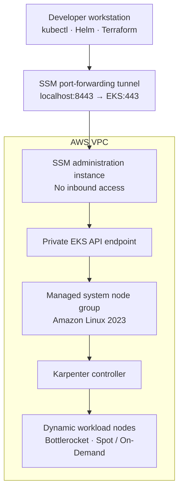

# Zero-Trust Amazon EKS with Karpenter

A production-oriented Terraform reference implementation for deploying a private Amazon EKS cluster with secure, auditable administrative access through AWS Systems Manager (SSM) and just-in-time worker capacity through Karpenter.

The repository is organized around reusable Terraform modules and isolated environment roots for development, staging, and production.

> [!IMPORTANT]
> This repository is a reference implementation. Review IAM policies, network boundaries, quotas, supported versions, and organizational controls before deploying it in a production AWS account.

## Architecture



### Request and provisioning flow

1. An operator establishes an authenticated SSM port-forwarding session through the administration instance.
2. `kubectl`, Helm, and the Kubernetes Terraform provider reach the private EKS API through the local tunnel.
3. A fixed managed node group hosts critical system workloads and the Karpenter controller.
4. Karpenter evaluates unschedulable pods and launches right-sized Bottlerocket nodes using Spot or On-Demand capacity.
5. EventBridge and SQS deliver interruption and lifecycle events so Karpenter can drain and replace affected capacity.

## Design principles

- **Private control plane:** Public access to the Kubernetes API is disabled.
- **SSM-only administration:** The administration instance has no inbound security-group rules and requires no SSH keys.
- **Stable system capacity:** Critical add-ons and the Karpenter controller run on a dedicated EKS managed node group.
- **Elastic workload capacity:** Karpenter provisions instances according to pending pod requirements and scheduling constraints.
- **Hardened worker nodes:** Dynamic nodes use Bottlerocket, encrypted EBS volumes, and IMDSv2 with a hop limit of `1`.
- **Workload-scoped AWS identity:** Karpenter uses EKS Pod Identity; long-lived AWS credentials are not stored in the cluster.
- **Interruption awareness:** EventBridge and SQS provide Spot interruption and instance lifecycle notifications.
- **Environment isolation:** Development, staging, and production share modules while maintaining independent configuration and state.

## Repository layout

```text
.
├── environments/
│   ├── dev/
│   │   ├── main.tf
│   │   ├── outputs.tf
│   │   ├── providers.tf
│   │   ├── terraform.tfvars
│   │   └── variables.tf
│   ├── staging/
│   │   └── ...
│   └── prod/
│       └── ...
├── modules/
│   ├── bastion/
│   ├── eks_control_plane/
│   ├── karpenter_iam/
│   ├── karpenter_resources/
│   │   └── manifests/
│   │       ├── ec2nodeclass.yaml
│   │       └── nodepool-stateless.yaml
│   └── vpc/
├── README.md
└── track.log
```

## Components

| Component | Responsibility |
| --- | --- |
| VPC | Multi-AZ networking, private subnets, routing, and controlled outbound connectivity |
| EKS control plane | Private Kubernetes API, KMS encryption, managed add-ons, and system node capacity |
| SSM administration instance | Authenticated path to the private EKS endpoint without inbound network access |
| Karpenter IAM | Controller identity, worker-node role, interruption queue, and event rules |
| Karpenter resources | Helm release, `EC2NodeClass`, and workload-specific `NodePool` resources |

## Prerequisites

- An AWS account and credentials authorized to manage VPC, EKS, EC2, IAM, KMS, EventBridge, and SQS resources
- Terraform `>= 1.5`
- AWS CLI v2
- `kubectl`
- AWS Session Manager plugin

Confirm the local toolchain and active AWS identity:

```bash
terraform version
aws --version
kubectl version --client
session-manager-plugin --version
aws sts get-caller-identity
```

## Configuration

Select an environment and review its `terraform.tfvars` before deployment:

```hcl
aws_region   = "us-east-1"
environment  = "prod"
cluster_name = "prod-eks-karpenter"
vpc_cidr     = "10.100.0.0/16"
```

Never commit credentials, secrets, account-specific identifiers, generated plans, or sensitive backend configuration.

## Deployment

Because the EKS API is private, deployment uses two phases:

1. Provision the AWS foundation required to reach the cluster.
2. Establish the SSM tunnel, then converge resources that use Kubernetes and Helm providers.

The examples below target `prod`. Replace it with `dev` or `staging` as appropriate.

### 1. Initialize and review

```bash
cd environments/prod
terraform init
terraform fmt -check -recursive ../..
terraform validate
terraform plan -out=tfplan
```

### 2. Bootstrap the AWS foundation

```bash
terraform apply \
  -target=module.vpc \
  -target=module.eks \
  -target=module.karpenter_iam \
  -target=module.bastion
```

> [!NOTE]
> Targeted apply is used only to bootstrap connectivity to the private cluster. Always follow it with an un-targeted `terraform plan` and `terraform apply` so the configuration fully converges.

### 3. Establish the SSM tunnel

Inspect the outputs to obtain the administration instance ID and EKS endpoint:

```bash
terraform output
```

Map the EKS endpoint hostname to the loopback interface. Retaining the original hostname preserves TLS certificate validation:

```bash
echo "127.0.0.1 <EKS_ENDPOINT_HOST>" | sudo tee -a /etc/hosts
```

Start the tunnel in a separate terminal and keep the session active:

```bash
aws ssm start-session \
  --region <AWS_REGION> \
  --target <BASTION_INSTANCE_ID> \
  --document-name AWS-StartPortForwardingSessionToRemoteHost \
  --parameters '{"host":["<EKS_ENDPOINT_HOST>"],"portNumber":["443"],"localPortNumber":["8443"]}'
```

### 4. Configure Kubernetes access

In another terminal, create or update the kubeconfig entry:

```bash
aws eks update-kubeconfig \
  --region <AWS_REGION> \
  --name <CLUSTER_NAME> \
  --alias <CLUSTER_NAME>
```

Route that entry through the local tunnel:

```bash
kubectl config set-cluster <CLUSTER_NAME> \
  --server=https://<EKS_ENDPOINT_HOST>:8443
```

Verify connectivity:

```bash
kubectl cluster-info
kubectl get nodes -o wide
```

> [!TIP]
> Running `aws eks update-kubeconfig` again restores the server URL to port `443`. Reapply `kubectl config set-cluster` while the SSM tunnel is in use.

### 5. Converge the full configuration

With the SSM tunnel active:

```bash
terraform plan -out=tfplan
terraform apply tfplan
```

This installs Karpenter and applies the configured `EC2NodeClass` and `NodePool` resources.

## Verification

### System capacity

```bash
kubectl get nodes -l workload.type=system -o wide
```

### Karpenter health and resources

```bash
kubectl get pods -n karpenter
kubectl get nodepools
kubectl get ec2nodeclasses
kubectl get nodeclaims
```

### Provisioning activity

Deploy a workload with explicit CPU and memory requests, then follow controller activity:

```bash
kubectl logs -n karpenter \
  -l app.kubernetes.io/name=karpenter \
  -c controller \
  --follow
```

Inspect the resulting nodes and capacity characteristics:

```bash
kubectl get nodes \
  -L karpenter.sh/capacity-type,kubernetes.io/arch,node.kubernetes.io/instance-type
```

## Security controls

| Control | Implementation |
| --- | --- |
| Control-plane exposure | Private-only EKS endpoint |
| Administrative access | SSM Session Manager; no inbound rules or SSH keys |
| Kubernetes secret encryption | Customer-managed AWS KMS key |
| Worker storage | Encrypted EBS volumes |
| Instance metadata | IMDSv2 required; hop limit set to `1` |
| Dynamic node OS | Bottlerocket |
| AWS identity | Separate controller and worker-node IAM roles; EKS Pod Identity for Karpenter |
| Resource discovery | Cluster-specific subnet and security-group tags |
| System workload isolation | Dedicated, tainted managed nodes |
| Interruption response | EventBridge events delivered through SQS to Karpenter |

## Operational and cost considerations

- Production deployments should span multiple Availability Zones. NAT gateway topology should balance failure-domain isolation against cost.
- Spot capacity reduces compute cost but remains interruptible. Use disruption budgets, topology spread constraints, and multiple eligible instance families.
- Define realistic pod requests and limits; Karpenter's provisioning decisions depend on accurate scheduling requirements.
- Apply `PodDisruptionBudget` resources to highly available services, while ensuring they do not prevent safe consolidation or node replacement.
- Pin and test Terraform, provider, EKS, add-on, and Karpenter versions as a compatible release set.
- Promote reviewed changes between environments and inspect every production plan before approval.
- Monitor SQS queue depth, Karpenter reconciliation errors, unschedulable pods, node churn, and Spot interruption rates.

## Troubleshooting

| Symptom | Likely cause | Resolution |
| --- | --- | --- |
| EKS API request times out | The private API is unreachable because the tunnel is inactive | Start the SSM port-forwarding session and retry |
| `TargetNotConnected` | The administration instance is not registered with Systems Manager | Check the SSM agent, instance profile, DNS resolution, and outbound HTTPS connectivity |
| `SessionManagerPlugin` is not found | The local Session Manager plugin is missing | Install the plugin and restart the shell |
| TLS certificate is valid for the EKS hostname, not `localhost` | Kubeconfig points directly to `localhost` | Map the EKS hostname to `127.0.0.1` and retain that hostname in the server URL |
| Connection refused on `127.0.0.1:443` | `update-kubeconfig` restored the default port | Set the kubeconfig server URL back to `https://<EKS_ENDPOINT_HOST>:8443` |
| Pod Identity association reports that the cluster does not exist | Terraform dependency ordering is incomplete | Add an explicit dependency from the Karpenter IAM resources to the EKS module where data flow does not imply one |
| Managed node-group AMI is rejected | The AMI type is incompatible with the selected EKS version | Select a supported type such as `AL2023_x86_64_STANDARD` and verify current EKS compatibility |
| Pods remain pending and no `NodeClaim` appears | Pod constraints do not match the `NodePool`, or the controller lacks permissions | Inspect pod events, Karpenter logs, NodePool limits, taints, requirements, IAM, and EC2 quotas |
| A `NodeClaim` is created but the node does not join | Bootstrap, networking, IAM, or security-group configuration is invalid | Inspect the `NodeClaim`, EC2 instance status, node role, cluster access, subnet routes, and security groups |

The complete implementation and troubleshooting history is available in [`track.log`](./track.log).

## Destroying an environment

Keep the SSM tunnel active while Terraform removes resources managed through Kubernetes or Helm, then destroy the remaining AWS infrastructure:

```bash
cd environments/<environment>
terraform plan -destroy -out=destroy.tfplan
terraform apply destroy.tfplan
```

> [!WARNING]
> Review the destruction plan carefully. This operation permanently removes the selected environment. Retained volumes, snapshots, load balancers, or externally managed resources may require separate cleanup.

## Roadmap

- [ ] Backup and disaster recovery with Velero
- [ ] Runtime threat detection with Falco
- [ ] Centralized metrics, logs, dashboards, and alerting
- [ ] Admission policy enforcement with Kyverno or OPA Gatekeeper
- [ ] Automated validation and deployment through CI/CD
- [ ] Additional NodePools for stateful, compute-intensive, and ARM64 workloads

## Disclaimer

This project is intended as a production-oriented reference architecture, not a turnkey production platform. Validate IAM permissions, network design, Kubernetes and Karpenter compatibility, service quotas, recovery procedures, observability, and organizational security requirements before adoption.
